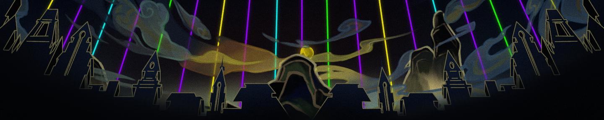

# APower Subnet Bridge



## Foundry

**Foundry is a blazing fast, portable and modular toolkit for Ethereum application development written in Rust.**

Foundry consists of:

-   **Forge**: Ethereum testing framework (like Truffle, Hardhat and DappTools).
-   **Cast**: Swiss army knife for interacting with EVM smart contracts, sending transactions and getting chain data.
-   **Anvil**: Local Ethereum node, akin to Ganache, Hardhat Network.
-   **Chisel**: Fast, utilitarian, and verbose solidity REPL.

## Documentation

https://book.getfoundry.sh/

## Usage

### Build

```shell
forge build
```

### Test

```shell
forge test
```

### Format

```shell
forge fmt
```

### Gas Snapshots

```shell
forge snapshot
```

### Anvil

```shell
anvil
```

### Deploy

Deploy the `MySource` calculator facade on the mainnet (or testnet):

```shell
forge script script/MySource.s.sol --rpc-url main ## --broadcast
```

Deploy the `MyTarget` calculator implementation on the APower subnet:

```shell
forge script script/MyTarget.s.sol --rpc-url apow ## --broadcast
```

### Cast

```shell
cast <subcommand>
```

### Help

```shell
forge --help
anvil --help
cast --help
```

## Copyright

© 2024 [Blackhan Software Ltd](https://www.linkedin.com/company/blackhan)
